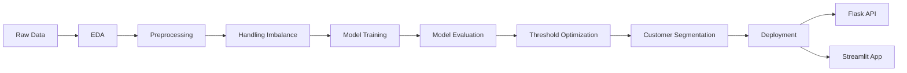
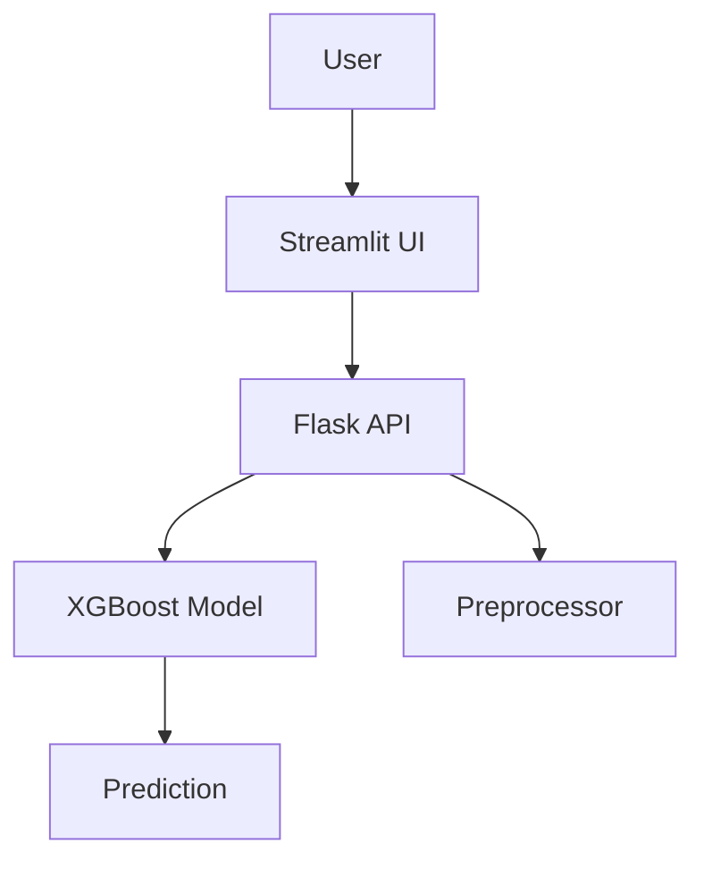

# 🚀 Term Deposit Subscription Prediction


---

## 📌 Overview

An end-to-end machine learning project that predicts whether a customer will subscribe to a term deposit.

This project demonstrates:
- Full ML lifecycle (EDA → Modeling → Deployment)
- Business-focused decision making
- Real-world deployment with API + UI

---

## 🧠 Problem Statement

Banks spend significant time and resources contacting customers during marketing campaigns. A poor targeting strategy increases operational cost, wastes call-center effort, and lowers campaign efficiency.

This project addresses that challenge by building a classification system that predicts subscription likelihood before outreach decisions are made. The end goal is to help business teams:
- target customers more effectively
- improve campaign conversion rates
- reduce wasted outreach
- understand the attributes associated with stronger purchase intent

---

## ⚙️ Project Workflow



---

## 📊 Machine Learning Pipeline

### 🔹 Data Processing
- Encoding categorical variables
- Feature transformation
- Scaling

### 🔹 Modeling
- Logistic Regression
- Decision Tree
- Random Forest
- XGBoost (final model)

### 🔹 Optimization
- Threshold tuning
- Precision-Recall balancing

---

## 📈 Model Performance

| Metric     | Score |
|-----------|------|
| Accuracy  | 0.89 |
| Precision | 0.86 |
| Recall    | 0.93 |
| F1 Score  | 0.89 |

---

## 👥 Customer Segmentation

3 key customer segments identified:
- Affluent professionals
- Middle-income homeowners
- Financially constrained borrowers

---

## 🏗️ Architecture



---

## 🛠️ Tech Stack

- Python
- Pandas / NumPy
- Scikit-learn
- XGBoost
- Flask
- Streamlit
- Docker

---

## 🚀 How to Run

```bash
git clone https://github.com/samuelmugisha/ttYINgpDAx5aUBwk.git
cd ttYINgpDAx5aUBwk
```

### Run Backend
```bash
cd backend_files
pip install -r requirements.txt
python app.py
```

### Run Frontend
```bash
cd frontend_files
pip install -r requirements.txt
streamlit run app.py
```

---

## 💡 Key Highlights

- End-to-end ML system (not just a notebook)
- Real-world deployment mindset
- Business-focused model tuning
- Clean and modular architecture

---

## 🎯 For Recruiters & Hiring Managers

This project demonstrates my ability to:

✔ Build production-ready ML systems  
✔ Translate business problems into data solutions  
✔ Optimize models beyond accuracy  
✔ Deploy ML solutions with real interfaces  

I focus on delivering **impact, not just models**.

---

## ⭐ Final Note

If you're looking for someone who can own the full ML lifecycle — from data exploration to deployment — this project reflects exactly how I work.
