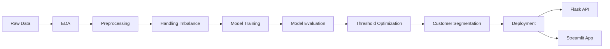
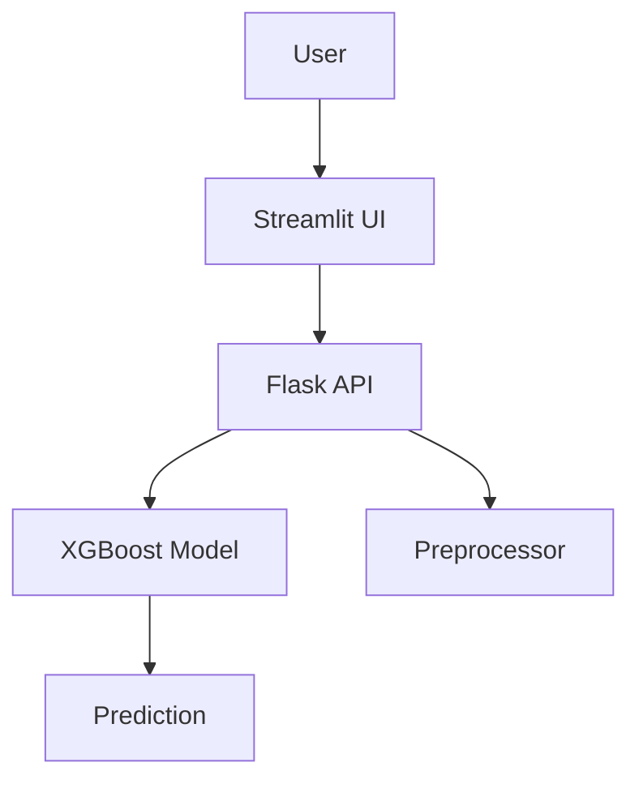

# 🚀 Term Deposit Subscription Prediction


---

## 📌 Overview

An end-to-end machine learning project that predicts whether a customer will subscribe to a term deposit.

This project demonstrates:
- Full production-ready ML lifecycle (EDA → Modeling → Deployment)
- Business-focused decision making: Translating business problems into data solutions 
- Real-world deployment with API + UI
- Optimize models beyond accuracy
- Deploy ML solutions with real interfaces 

---

## 🧠 Problem Statement

Banks spend significant time and resources contacting customers during marketing campaigns. A poor targeting strategy increases operational cost, wastes call-center effort, and lowers campaign efficiency.

This project addresses that challenge by building a classification system that predicts subscription likelihood before outreach decisions are made. The end goal is to help business teams:
- target customers more effectively
- improve campaign conversion rates
- reduce wasted outreach
- understand the attributes associated with stronger purchase intent

---

## ⚙️ Project Workflow



---

## 📊 Step-by-Step Project Flow

### 1. Problem Framing and Success Criteria
The project started with translating the business question into a machine learning task: predict whether a customer will subscribe to a term deposit. The original benchmark was to exceed 81% accuracy while still producing a practically useful model for business decision-making.

### 2. Exploratory Data Analysis
The dataset was examined to understand feature distributions, class balance, and campaign behavior. This stage helped identify:
- dominant job categories and customer demographics
- strong imbalance in the target variable
- campaign timing patterns by month
- opportunities to derive business insight from both customer and contact features

### 3. Data Preprocessing
The raw data was prepared for modeling through a structured preprocessing workflow. This included:
- separating predictors from the target
- transforming categorical features into machine-readable form
- scaling numeric variables
- preparing a reusable preprocessing object for deployment
- handling class imbalance through resampling so the model could better learn the minority subscription class

### 4. Model Development and Comparison
Multiple classification algorithms were evaluated to determine the best-performing approach. The experimentation included:
- Logistic Regression
- K-Nearest Neighbors
- Decision Tree
- Random Forest
- XGBoost

This comparison stage demonstrates a thoughtful modeling process rather than jumping directly to a single algorithm.

### 5. Hyperparameter Tuning
The stronger candidate models were tuned to improve generalization and business usefulness. Cross-validation and parameter search were used to refine performance.

### 6. Threshold Optimization
Instead of stopping at the default decision threshold, the project explicitly optimized the classification threshold using F1-score. This is important because the business problem involves balancing false positives and false negatives, not just maximizing raw accuracy.

### 7. Customer Segmentation with Clustering
The work extended beyond prediction into segmentation. Customers who subscribed were grouped into clusters to identify meaningful business segments. This makes the solution more actionable for marketing teams by highlighting which customer profiles are most promising.

### 8. Model Packaging and Deployment
The trained artifacts were serialized and prepared for serving. The repository includes:
- a Flask backend API for inference
- a Streamlit frontend for interactive prediction
- Dockerfiles for containerized deployment
- model and preprocessing artifacts for reproducible inference

This shows the project was taken beyond notebook experimentation into deployable application form.

---

## 📈 Model Performance
#Best model: XGBoost
| Metric     | Score |
|-----------|------|
| Accuracy  | 0.89 |
| Precision | 0.86 |
| Recall    | 0.93 |
| F1 Score  | 0.89 |

---

## 👥 Customer Segmentation

3 key customer segments identified:
- Affluent professionals
- Middle-income homeowners
- Financially constrained borrowers

---

## 🏗️ Architecture



---
## Repository Structure

```text
.
├── backend_files/
│   ├── app.py
│   ├── Dockerfile
│   ├── final_subscription_model.joblib
│   ├── final_subscription_model.json
│   ├── preprocessor.joblib
│   └── requirements.txt
├── data/
├── frontend_files/
│   ├── app.py
│   ├── Dockerfile
│   ├── requirements.txt
│   └── note
├── models/
│   └── XGBClassifier_best_model_threshold.joblib
├── notebooks/
│   ├── Clustering.ipynb
│   ├── Deployment.ipynb
│   ├── EDA.ipynb
│   ├── Modelling.ipynb
│   └── Preprocessing.ipynb
└── README.md
```

---

## 🛠️ Tech Stack

- Python
- Pandas / NumPy
- Scikit-learn
- XGBoost
- Flask
- Streamlit
- Docker

---

## 🚀 How to Run

```bash
git clone https://github.com/samuelmugisha/ttYINgpDAx5aUBwk.git
cd ttYINgpDAx5aUBwk
```

### Run Backend
```bash
cd backend_files
pip install -r requirements.txt
python app.py
```

### Run Frontend
```bash
cd frontend_files
pip install -r requirements.txt
streamlit run app.py
```

---

## 💡 Key Highlights

- End-to-end ML system (not just a notebook)
- Real-world deployment mindset
- Business-focused model tuning
- Clean and modular architecture

---


## ⭐ Final Note

If you're looking for someone who can own the full ML lifecycle — from data exploration to deployment — this project reflects exactly how I work.
