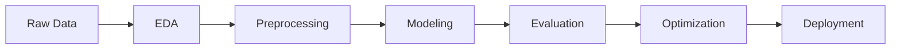
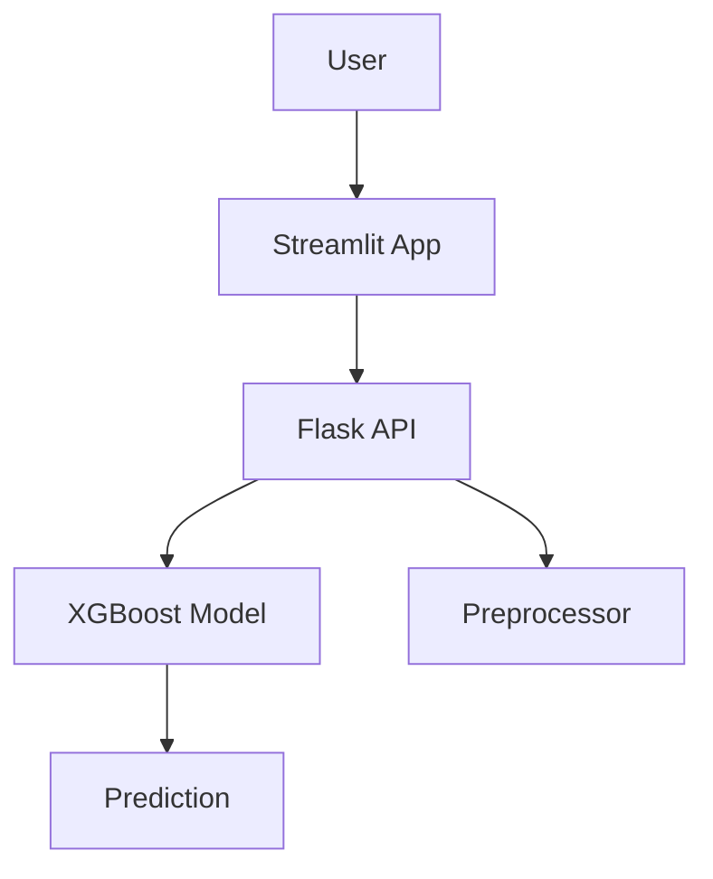

# 🚀 Term Deposit Subscription Prediction (Portfolio Project)


---

## 🌟 Project Snapshot

An end-to-end machine learning system that predicts whether a customer will subscribe to a term deposit, built with a strong focus on **business impact and deployment**.

---

## 🖥️ Live App Preview

### 📊 Streamlit Interface


### 🔮 Prediction Output


> 📌 *Replace the images above with actual screenshots from your app (store them in an `images/` folder in your repo).*

---

## 🧠 Problem

Banks need to identify high-probability customers to:
- Improve conversion rates
- Reduce marketing costs
- Optimize outreach strategies

---

## ⚙️ Solution

✔ Built a classification model using **XGBoost**  
✔ Handled class imbalance  
✔ Tuned decision threshold for business performance  
✔ Deployed via **Flask API + Streamlit UI**

---

## 🔄 Workflow Overview



---

## 🏗️ System Architecture



---

## 📊 Results

| Metric     | Score |
|-----------|------|
| Accuracy  | 0.89 |
| Precision | 0.86 |
| Recall    | 0.93 |
| F1 Score  | 0.89 |

---

## 🛠️ Tech Stack

- Python
- Scikit-learn
- XGBoost
- Flask
- Streamlit
- Docker

---

## 🚀 Run Locally

```bash
git clone https://github.com/samuelmugisha/ttYINgpDAx5aUBwk.git
cd ttYINgpDAx5aUBwk
```

Backend:
```bash
cd backend_files
pip install -r requirements.txt
python app.py
```

Frontend:
```bash
cd frontend_files
pip install -r requirements.txt
streamlit run app.py
```

---

## 💼 Why This Project Stands Out

- End-to-end ML pipeline (not just notebooks)
- Business-driven model decisions
- Real deployment architecture
- Clean, modular, production-style structure

---

## 🎯 For Recruiters

This project highlights my ability to:
- Build ML systems from scratch
- Think in terms of business impact
- Deploy models into usable applications
- Communicate insights clearly

---

## ⭐ Final Note

This is the kind of work I aim to bring into real-world teams:  
**practical, scalable, and impact-driven machine learning.**
